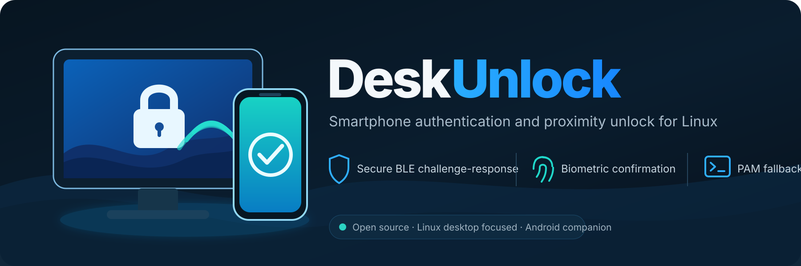
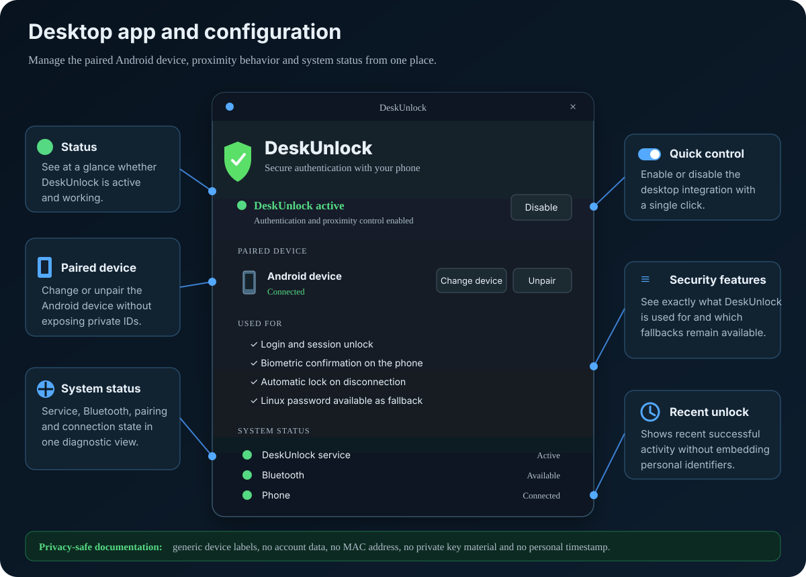
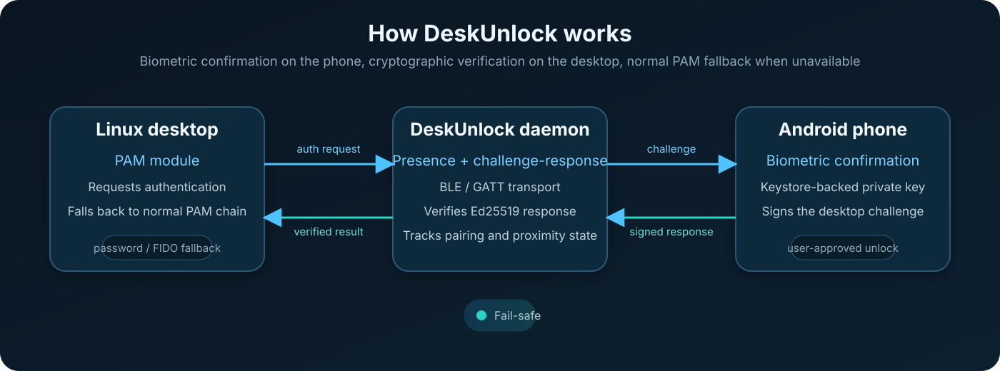

<p align="center">
  
</p>

<p align="center">
  <strong>Smartphone authentication and proximity unlock for Linux.</strong>
</p>

<p align="center">
  
  
  
  
  
  
</p>

DeskUnlock is an independent desktop-focused fork of the MIT-licensed [`syauth`](https://github.com/dmytrogajewski/syauth) project. It lets a paired Android smartphone act as a secure authentication factor for Linux desktop login and unlock workflows while keeping a normal PAM fallback available when the phone or Bluetooth path is unavailable.

> **Project status:** pre-release / portability work in progress. The current downstream implementation has been tested on an Arch-based CachyOS system. Broader distro and desktop support is a contribution target, not yet a compatibility claim.

## Why DeskUnlock?

Passive Bluetooth proximity alone should not be enough to unlock a computer. DeskUnlock keeps the cryptographic phone-as-key design from `syauth` and adds the pieces needed for a practical desktop workflow: packaging, health checks, first-run setup, proximity behavior, settings, lock-screen integration, and operational safeguards.

### Current downstream features

- cryptographic challenge-response with the paired phone;
- per-unlock biometric confirmation on Android;
- Bluetooth LE / GATT transport;
- PAM integration with password fallback;
- proximity-aware lock behavior;
- desktop settings GUI;
- master ON/OFF switch;
- single-device pairing policy;
- health and status checks;
- systemd user services;
- Arch/CachyOS package management;
- cryptographic state stored outside the package payload.

## Desktop app

DeskUnlock includes a desktop settings application for managing the paired Android device, controlling proximity authentication, and checking the current system status.

<p align="center">
  
</p>

The application provides quick access to activation controls, paired-device management, security features, Bluetooth and service status, and recent unlock information.

## How it works

<p align="center">
  
</p>

The desktop PAM path requests authentication from the DeskUnlock user daemon. The daemon exchanges a cryptographic challenge with the paired Android device over BLE/GATT. The phone asks for biometric approval, signs the challenge using its protected key material, and returns the response for desktop verification.

If the phone, Bluetooth transport, daemon, or authentication socket is unavailable, DeskUnlock must **fail safely** and return control to the normal configured PAM path rather than grant access.

See [docs/architecture.md](docs/architecture.md) for the technical design.

## Security model

DeskUnlock is security-sensitive software and should be treated accordingly.

- Proximity alone is not sufficient for authentication.
- The phone performs user-approved biometric confirmation.
- Authentication uses cryptographic challenge-response.
- Desktop verification happens before PAM accepts the result.
- Password and other configured PAM methods remain available as fallback.
- Keys, pairing state, and runtime state are kept outside the distributable package payload.

The project has **not** received an independent professional security audit. See [docs/security-model.md](docs/security-model.md) and [SECURITY.md](SECURITY.md).

## Current compatibility

The downstream build that became DeskUnlock has been tested with:

| Area | Current status |
| --- | --- |
| Linux | Tested on CachyOS / Arch-based environment |
| Init/session | systemd user services |
| Bluetooth | BlueZ + BLE/GATT |
| Authentication | PAM |
| Phone | Android companion |
| Desktop | Wayland usage tested |
| Lock screen | DMS adapter tested in the original environment |
| Packaging | Arch/CachyOS package groundwork |

DMS-specific integration is currently treated as an adapter layer. The public project does not yet claim universal desktop or distro support.

## Installation

Public installation instructions are intentionally conservative until clean-machine portability testing is complete.

The first public Arch package target is expected to be:

```text
deskunlock
```

See [docs/installation.md](docs/installation.md) and [docs/packaging.md](docs/packaging.md).

## Project layout

<table>
  <tr>
    <td><b>📦 crates/</b></td>
    <td>Rust desktop and core authentication components.</td>
  </tr>
  <tr>
    <td><b>📱 syauth-android/</b></td>
    <td>Android companion app used for approval and biometric confirmation.</td>
  </tr>
  <tr>
    <td><b>🖥️ desktop/</b></td>
    <td>Desktop integration helpers, session logic and user-facing tooling.</td>
  </tr>
  <tr>
    <td><b>📁 packaging/</b></td>
    <td>Arch/CachyOS packaging groundwork and distribution-related files.</td>
  </tr>
  <tr>
    <td><b>📚 docs/</b></td>
    <td>Architecture notes, installation guidance and security documentation.</td>
  </tr>
  <tr>
    <td><b>🎨 assets/</b></td>
    <td>Branding assets, README graphics and project visuals.</td>
  </tr>
  <tr>
    <td><b>🛠️ scripts/</b></td>
    <td>Audit, build, sync and development helper scripts.</td>
  </tr>
</table>

## Contributing

> [!TIP]
> Contributions are welcome — especially where DeskUnlock becomes more robust, portable and friendly for real desktop use.

### Good contribution areas

- **Desktop integrations** — KDE, GNOME, lock-screen bridges and session behavior.
- **Android compatibility** — device testing, BLE/GATT reliability and biometric approval flow.
- **Security review** — PAM portability, hardening and authentication logic.
- **GUI and usability** — settings, onboarding and status reporting.
- **Packaging** — Arch/CachyOS today, additional Linux distributions later.
- **Documentation** — guides, diagrams, examples and translations.

➡️ Please read **[CONTRIBUTING.md](CONTRIBUTING.md)** before opening a pull request.

## Upstream and license

<table>
  <tr>
    <td><b>Upstream</b></td>
    <td><a href="https://github.com/dmytrogajewski/syauth">dmytrogajewski/syauth</a></td>
  </tr>
  <tr>
    <td><b>DeskUnlock focus</b></td>
    <td>Linux desktop integration, usability, packaging, proximity behavior and smartphone-assisted authentication.</td>
  </tr>
  <tr>
    <td><b>License</b></td>
    <td>MIT — original upstream copyright notice preserved.</td>
  </tr>
  <tr>
    <td><b>Legal / third-party notes</b></td>
    <td><a href="NOTICE.md">NOTICE.md</a> · <a href="THIRD_PARTY_LICENSES.md">THIRD_PARTY_LICENSES.md</a></td>
  </tr>
</table>