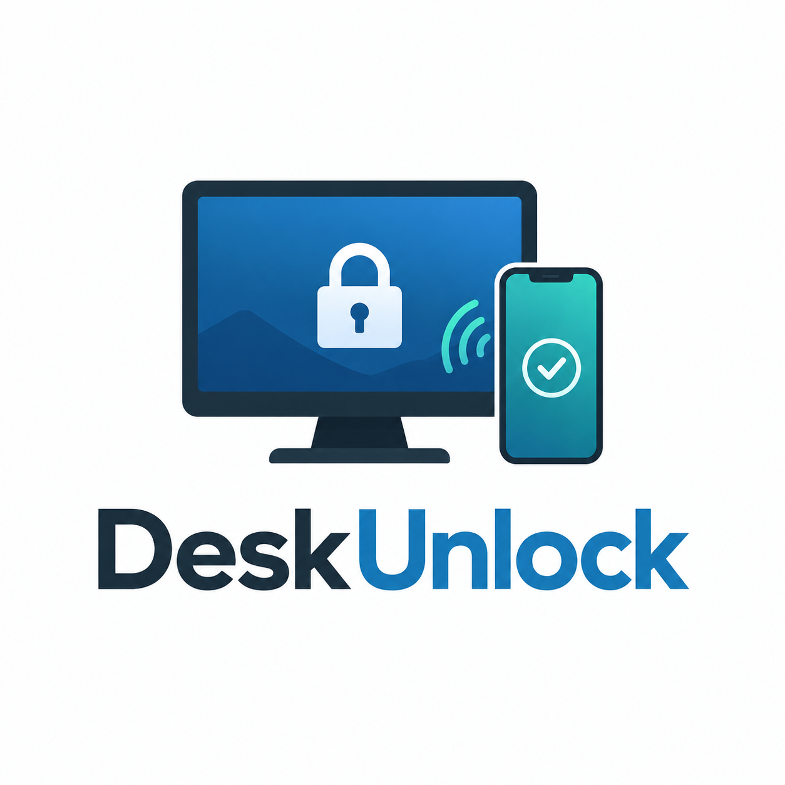

<p align="center">
  
</p>

# DeskUnlock

**Smartphone authentication and proximity unlock for Linux.**

DeskUnlock is an independent desktop-focused fork of the MIT-licensed `syauth` project and an open-source Linux authentication project that lets a paired Android smartphone act as a secure authentication factor for desktop login and unlock workflows. It combines Bluetooth Low Energy presence, cryptographic challenge-response, biometric confirmation on the phone, PAM integration, and a normal password fallback.

> **Project status:** pre-release / portability work in progress. The current downstream implementation has been tested on an Arch-based CachyOS system. Broader distro and desktop support is a contribution target, not yet a compatibility claim.

## Why DeskUnlock?

Passive Bluetooth proximity alone should not be enough to unlock a computer. DeskUnlock builds on the MIT-licensed `syauth` project and keeps the cryptographic phone-as-key design while adding desktop integration, packaging, health checks, a settings GUI, first-run provisioning, and operational safeguards.

Current downstream features include:

- cryptographic challenge-response with the paired phone;
- per-unlock biometric confirmation on Android;
- Bluetooth LE / GATT presence transport;
- PAM integration with password fallback;
- proximity-aware lock behavior;
- a desktop settings GUI;
- a master ON/OFF switch;
- single-device pairing policy;
- health/status checks;
- systemd user services;
- Arch/CachyOS package management;
- state and cryptographic material kept outside the package payload.

## Security philosophy

DeskUnlock must fail safely. If the phone, Bluetooth transport, daemon, or authentication socket is unavailable, the PAM integration must fall through to the normal configured authentication path rather than grant access.

The project is security-sensitive software. It has **not** received an independent professional security audit. See [docs/security-model.md](docs/security-model.md) and [SECURITY.md](SECURITY.md).

## Architecture

```text
Android phone
    │
    │ BLE / GATT
    │ cryptographic challenge-response
    ▼
DeskUnlock presence daemon
    │
    ├── presence / proximity state
    ├── authentication socket
    └── pairing reconciliation
             │
             ▼
        PAM module
             │
             ├── success -> authentication accepted
             └── unavailable -> normal password/auth fallback
```

Desktop helpers provide settings, health monitoring, first-run setup, and lock-screen integration.

See [docs/architecture.md](docs/architecture.md).

## Current compatibility

The downstream build that became DeskUnlock has been tested with:

- Linux with systemd user services;
- BlueZ;
- PAM;
- Android phone;
- Arch/CachyOS packaging;
- Wayland desktop usage;
- a DMS-based lock-screen integration in the original test environment.

DMS-specific integration is currently being treated as an adapter/integration layer. The public project should not claim universal desktop support until clean-machine testing is complete.

## Installation

Public installation instructions are intentionally gated until the portability audit and clean-machine test pass.

The first public Arch package target is expected to be:

```text
deskunlock
```

See [docs/installation.md](docs/installation.md).

## Contributing

Contributions are welcome. Useful areas include:

- Arch, Debian, Fedora, openSUSE and other packaging;
- KDE, GNOME and other desktop/lock-screen integrations;
- Android compatibility testing;
- BLE/GATT reliability;
- PAM portability and security review;
- GUI improvements;
- automated tests;
- documentation and translations.

Please read [CONTRIBUTING.md](CONTRIBUTING.md) before submitting a pull request.

## Upstream and license

DeskUnlock is an independent fork of the MIT-licensed [`syauth`](https://github.com/dmytrogajewski/syauth) project, focused on Linux desktop integration, usability, packaging, proximity locking, and smartphone-assisted authentication.

The original copyright notice and MIT license are preserved. See [LICENSE](LICENSE), [NOTICE.md](NOTICE.md), and [THIRD_PARTY_LICENSES.md](THIRD_PARTY_LICENSES.md).

## Repository description

> Smartphone authentication and proximity unlock for Linux — BLE challenge-response, biometric confirmation, PAM fallback, and desktop integration.
